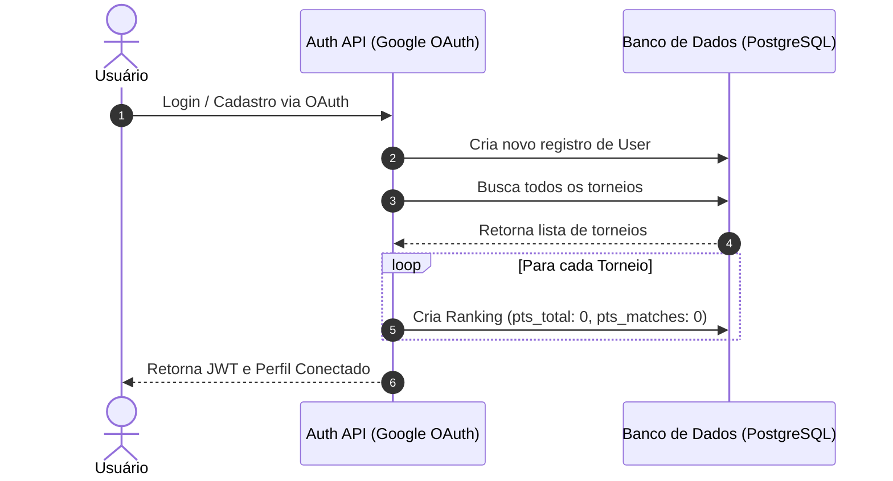

# Pontuação Inicial Zero para Novos Usuários no Ranking

Esta funcionalidade garante que todo novo usuário cadastrado no sistema seja imediatamente incluído no ranking geral de todos os torneios com **0 pontos**, permitindo que ele apareça na classificação antes mesmo de fazer qualquer palpite ou do torneio começar.

---

## 1. Contexto e Motivação

Anteriormente, a tabela de classificação geral (`Ranking`) era preenchida de forma reativa: um registro só era gerado para o usuário após ele enviar um palpite para uma partida e o administrador finalizar essa partida, disparando o recálculo de pontuação.

Isso causava dois problemas de Experiência do Usuário (UX):
1. **Ranking Vazio antes do Torneio**: Antes da Copa do Mundo ou do campeonato iniciar, a lista de classificação geral retornava vazia, mesmo com diversos usuários já cadastrados no Bolão.
2. **Usuários Invisíveis**: Usuários recém-cadastrados não constavam na tabela de líderes até que pontuassem, dando a sensação de que seu cadastro não havia sido concluído ou de que não faziam parte do jogo.

Ao inicializar cada usuário com **0 pontos** no ranking no momento do cadastro e garantir que o recálculo de ranking englobe todos os usuários do banco de dados, o painel de classificação torna-se dinâmico, completo e amigável desde o primeiro dia.

---

## 2. Detalhes de Implementação

A solução foi estruturada em duas camadas complementares e seguras para garantir consistência em qualquer cenário.

### Camada 1: Criação no Cadastro (`auth.service.ts`)
No serviço de autenticação (`AuthService`), após a persistência bem-sucedida do novo `User` e de sua respectiva `OauthAccount`, executamos uma varredura por todos os torneios ativos/cadastrados e criamos um registro de ranking inicial zerado para cada um:

```typescript
// 3. Se o e-mail não for encontrado, cria User + OauthAccount
user = await this.prisma.user.create({
  data: {
    email,
    name,
    avatar_url,
    oauth_accounts: {
      create: {
        provider,
        provider_account_id,
        access_token,
        refresh_token,
      },
    },
  },
});

// Cria registros de ranking zerados para todos os torneios existentes
const tournaments = await this.prisma.tournament.findMany();
for (const tournament of tournaments) {
  await this.prisma.ranking.create({
    data: {
      user_id: user.id,
      tournament_id: tournament.id,
      pts_total: 0,
      pts_matches: 0,
    },
  });
}
```

### Camada 2: Resiliência no Recálculo (`rankings.service.ts`)
Para evitar que recálculos futuros limpassem ou ignorassem usuários sem palpites (ou que pudessem ficar com posições incorretas), o método `recalculate` foi atualizado para inicializar o mapa de pontuações (`userPoints`) com **0** para todos os usuários cadastrados antes de processar as previsões:

```typescript
const userPoints: Record<string, { pts_total: number; pts_matches: number }> = {};

// Inicializa todos os usuários com 0 pontos para garantir que constem no ranking ordenado
const allUsers = await this.prisma.user.findMany();
for (const user of allUsers) {
  userPoints[user.id] = { pts_total: 0, pts_matches: 0 };
}

// Aplica a agregação de pontos com base nos palpites efetuados
for (const prediction of predictions) {
  if (!userPoints[prediction.user_id]) {
    userPoints[prediction.user_id] = { pts_total: 0, pts_matches: 0 };
  }
  const total = prediction.points.reduce((sum, p) => sum + p.pts_earned, 0);
  userPoints[prediction.user_id].pts_total += total;
  userPoints[prediction.user_id].pts_matches += 1;
}
```

Isso garante que:
- Mesmo que o usuário seja criado após a criação de um torneio e seu ranking inicial falhe por qualquer motivo, o primeiro recálculo de ranking do torneio gerará sua linha na tabela de líderes automaticamente.
- A classificação dinâmica do backend calcula a posição exata (incluindo empates) de todos os usuários com precisão matemática absoluta.

---

## 3. Fluxo de Dados



---

## 4. Benefícios Práticos

- **Visualização Premium**: A tela de rankings do frontend (`bolao-web`) exibe imediatamente todos os amigos e participantes cadastrados, mesmo com 0 pontos, gerando engajamento antes do início do torneio.
- **Consistência de Dados**: Garante que o número total de participantes no ranking seja idêntico ao total de contas cadastradas na plataforma.
- **Suporte a Empates**: Usuários com 0 pontos aparecem corretamente ordenados por nome alfabético (ou critério de desempate configurado) na mesma colocação empatada de início.
